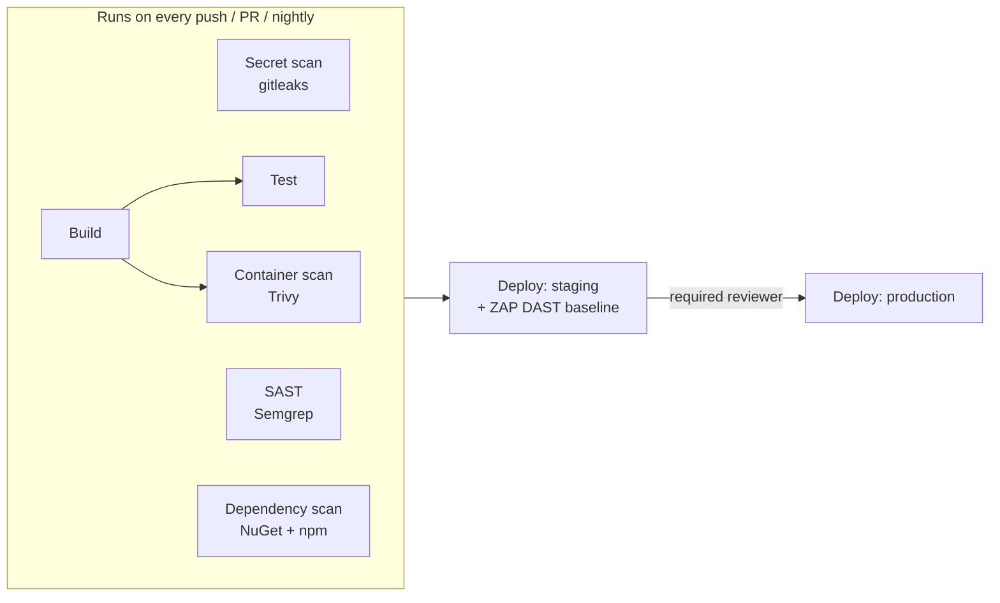

# AppSec Homelab

[](https://github.com/charles-goodsir/appsec-homelab/actions/workflows/security.yml)

A deliberately vulnerable full-stack app wrapped in a real CI/CD security pipeline — built to practice DevSecOps end to end: writing vulnerabilities, catching them with automated tooling, and fixing them for real.

This is a personal training project. It never runs anywhere but locally, and every vulnerability in it is intentional and commented in the code.

## Why this exists

I'm a software engineer (.NET/C#, TypeScript/React) building toward DevOps and DevSecOps, with application security as the specialty inside that. Rather than only studying vulnerabilities in isolation (PortSwigger labs, OWASP docs) or scanners in isolation, this project puts both in one place: code I wrote myself, in a stack I actually work in day-to-day, gated by a pipeline I built myself — so I can practice finding, exploiting, fixing, and catching the same bug classes I'll see in real codebases, the same way a real deployment gate would.

Write-ups for this project also live on my [portfolio's CyberDiary](https://charles-goodsir.github.io/my-portfolio/).

## Stack

- **Backend**: ASP.NET Core 8 Web API, EF Core + SQLite
- **Frontend**: React + TypeScript, Vite
- **Pipeline**: GitHub Actions (Semgrep SAST, gitleaks secret scanning — more planned)
- **Deployment**: Docker Compose (nginx-fronted), for running OWASP ZAP against a self-hosted target

## Seeded vulnerabilities

| # | Vulnerability | OWASP 2025 Category | Location | Status |
|---|---|---|---|---|
| 1 | SQL injection (login bypass) | A05:2025 - Injection | `AuthController.cs` — `Login()` | Fixed |
| 2 | SQL injection (search) | A05:2025 - Injection | `ProductsController.cs` — `Search()` | Fixed |
| 3 | Reflected XSS | A05:2025 - Injection | `ProductSearch.tsx` | Fixed |
| 4 | Plaintext password storage | A04:2025 - Cryptographic Failures | `SeedData.cs` / `User` model | Fixed |

Each is commented in code with `// VULNERABLE: <reason>` (or `// FIXED: <reason>` once remediated).

### Vulnerability walkthroughs (exploit → fix → re-test)

**SQL injection login bypass** — `AuthController.cs`
- Before: raw string interpolation built the query directly from request fields
  (`$"... WHERE Username = '{request.Username}' AND ..."`).
- Exploit: username `administrator'--`, any password — comments out the password
  check, logs in as administrator without knowing the real password.
- Fix: switched to a parameterized query (`@Name`/`@Password` as `DbParameter`s),
  so the injected `'--` is bound as literal string data instead of SQL syntax.
- Re-tested: the same payload now returns `401 Unauthorized`.

> **Semgrep false negative (historical):** while this bug was still live, the
> Semgrep pipeline did not flag it. Investigated and confirmed this was because
> the `csharp-sqli` rule doesn't treat `[FromBody]`-bound request objects as a
> tainted source, while `ProductsController.cs`'s `[FromQuery]` parameter was
> correctly recognised. Real gap in tool coverage, not in the code — worth
> knowing that a clean Semgrep run doesn't mean a clean codebase. Full
> investigation: [CyberDiary Entry 5](https://charles-goodsir.github.io/my-portfolio/#cyberdiary).

**SQL injection (search)** — `ProductsController.cs`
- Before: same raw-interpolation pattern in the `Search()` query.
- Fix: parameterized query with the `%wildcard%` applied to the parameter
  value, not concatenated into the SQL text.

**Reflected XSS** — `ProductSearch.tsx`
- Before: `dangerouslySetInnerHTML` rendered the search query as raw HTML.
- Exploit: search query `` — the `` tag
  rendered for real (broken-image icon in the DOM) and its `onerror` handler
  executed, firing the alert.
- Fix: reverted to plain JSX text interpolation (`{submittedQuery}`), which
  React escapes by default — the same payload now renders as inert literal
  text instead of executing.
- Re-tested: confirmed in-browser, no script execution, payload displayed
  as plain text.

**Plaintext password storage** — `SeedData.cs` / `User` model
- Before: the `User` model stored `Password` as a raw string, seeded and
  compared as plaintext (`Password = @Password` in the login query). A leaked
  database would expose every credential as-is.
- Fix: renamed the column to `PasswordHash` and switched to
  `Microsoft.AspNetCore.Identity`'s `PasswordHasher<User>` — a salted PBKDF2
  hash generated at seed time (`HashPassword`), verified at login time
  (`VerifyHashedPassword`) instead of a raw string comparison. The login query
  now looks up by username only; the password check happens in C#, not SQL.
- Re-tested: correct credentials still log in, a wrong password returns
  `401`, and the SQL injection payload from bug #1 still fails — confirming
  the parameterized query wasn't affected by the password-check rewrite.
- `sqlite3 appseclab.db "SELECT Username, PasswordHash FROM Users;"` shows
  hashed blobs, not plaintext.

*(Screenshots to come)*

### Hardening applied

Response headers set in `frontend/nginx.conf` (remediation for the ZAP baseline
scan): `X-Frame-Options: DENY`, `X-Content-Type-Options: nosniff`, a basic
`Content-Security-Policy`, and `server_tokens off` to hide the nginx version.

## Running locally

### With Docker Compose (single entry point)

```bash
docker compose up -d --build
```

Serves the whole app on `http://localhost:8080`. nginx serves the built
frontend and reverse-proxies `/api/*` to the backend container; only the
frontend port is published. This is the layout OWASP ZAP points at.

### Without Docker (dev)

**Backend:**
```bash
cd backend/AppSecLab.Api
dotnet run
```
Note the port printed in the console (e.g. `http://localhost:5001`). If it
differs, update the `/api` proxy target in `frontend/vite.config.ts`.

**Frontend:**
```bash
cd frontend
npm install
npm run dev
```
Opens at `http://localhost:5173`. The frontend calls the API with relative
`/api/...` URLs; Vite proxies those to the backend in dev.

## Pipeline

Every push and PR to `main` runs the full gate; `main` pushes additionally
deploy to staging (DAST included) and pause for manual approval before
production. A nightly cron run keeps dependency findings fresh even with
no code changes.



- [x] Vulnerable app scaffolded (SQLi, XSS, plaintext credentials)
- [x] Semgrep SAST in GitHub Actions, findings in the Security tab
- [x] gitleaks secret scanning in GitHub Actions
- [x] SCA — `dotnet list package --vulnerable` + `npm audit`, Dependabot enabled
- [x] Trivy container image scanning
- [x] Containerise (Docker Compose) for deployment to a self-hosted target
- [x] Run OWASP ZAP (DAST) against the deployed target, baseline scan
- [ ] ZAP active scan + AJAX spider (baseline-only currently misses planted SQLi/XSS)
- [ ] Additional vulnerability categories: Broken Access Control, Authentication Failures

## Disclaimer

This application is intentionally insecure and exists solely for personal security education. It is never deployed publicly and should never be used as a reference for production code.